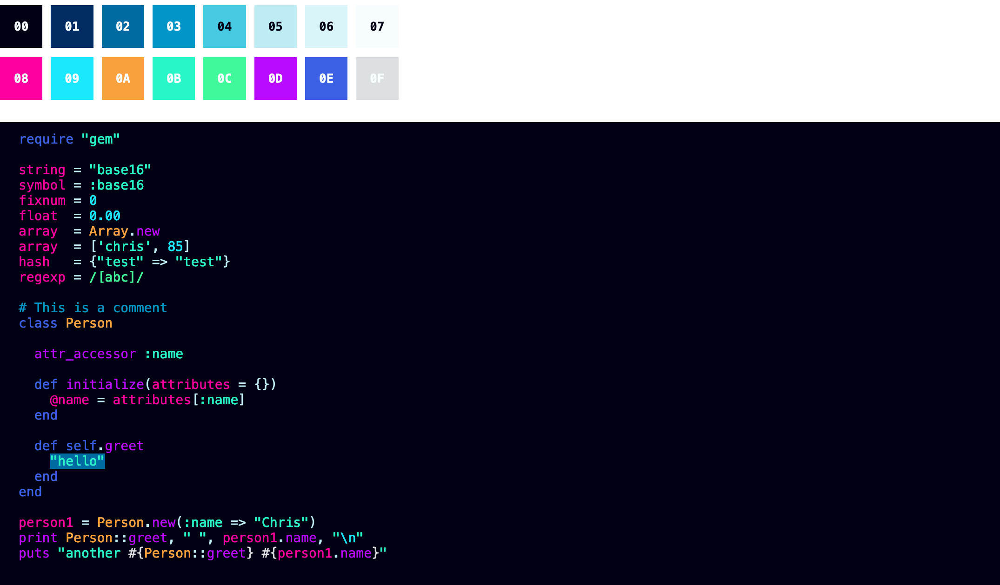

# Byss.

A Byss. Just one of them.

Have a look in the [dist](./dist) directory.

I find the font "[JetBrains Mono](https://www.jetbrains.com/lp/mono/)"
with the [Nerd Font patch](https://www.nerdfonts.com/font-downloads) on
the terminal is pleasing.

-   About the [Base 16 theme
    tool](https://github.com/chriskempson/base16)
-   Build with
    [pybase16-builder](https://pypi.org/project/pybase16-builder/)
